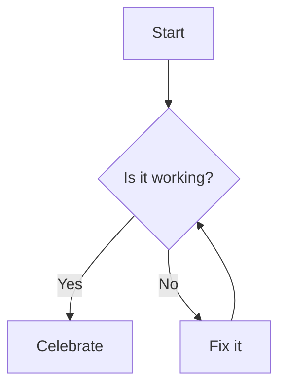
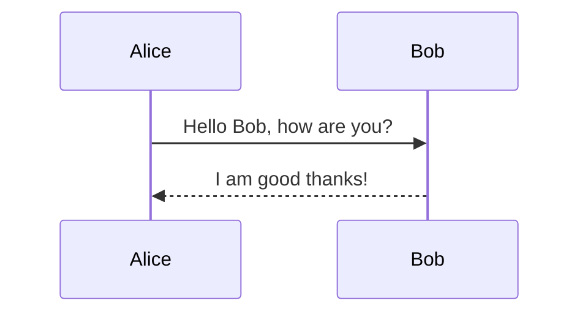
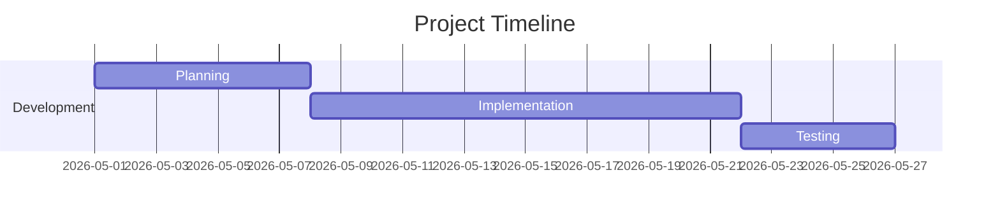
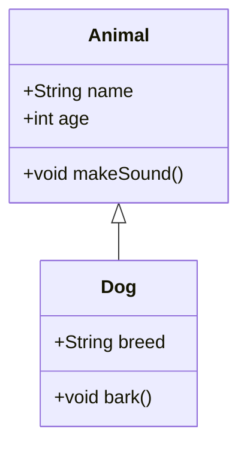
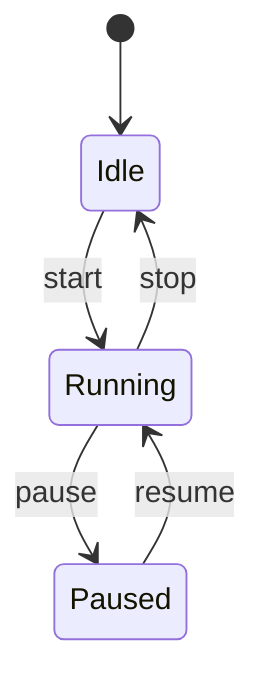
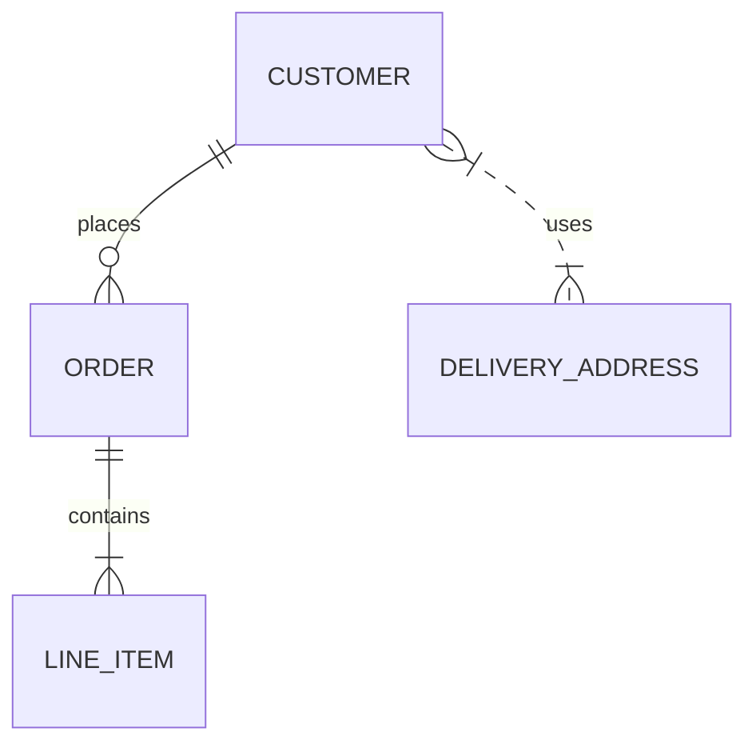
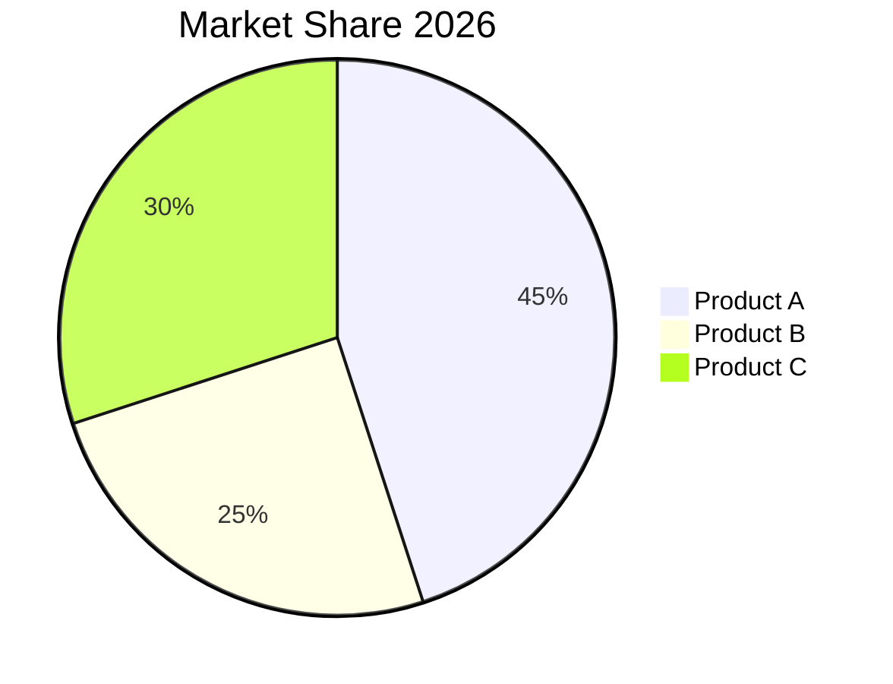
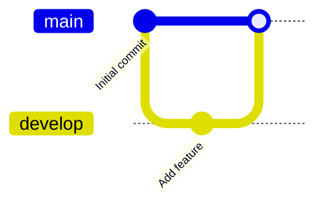
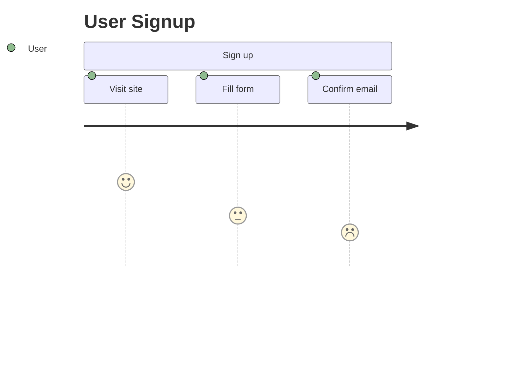

# Mermaid Examples

여러 종류의 Mermaid 차트 예제를 모아둔 저장소입니다. GitHub에서 README를 열어 다이어그램 렌더링을 확인하세요.

---

## Flowchart

## Sequence Diagram

## Gantt Chart

## Class Diagram

## State Diagram

## Entity Relationship (ER) Diagram

## Pie Chart

## Git Graph

## Journey

---

뷰어: GitHub, VSCode의 Mermaid 플러그인, 또는 https://mermaid.live/ 에 붙여넣어 확인하세요.

