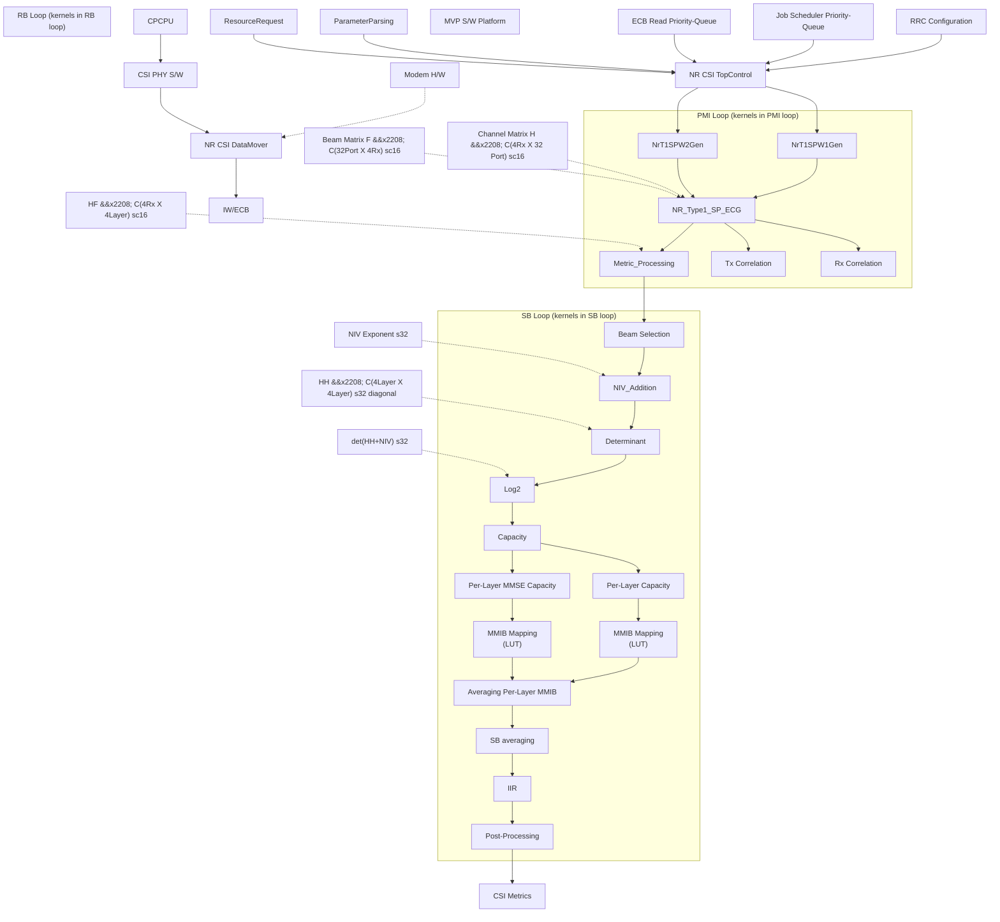

```mermaid
flowchart TD

    %% External platforms (gray)
    RRC["RRC Configuration"]
    JobScheduler["Job Scheduler Priority-Queue"]
    ECBRead["ECB Read Priority-Queue"]
    MVP["MVP S/W Platform"]
    ModemHW["Modem H/W"]
    CPCPU["CPCPU"]

    %% Data mover / interface
    DataMover["NR CSI DataMover"]
    IWECB["IW/ECB"]
    CSIPHY["CSI PHY S/W"]

    %% Main control
    TopControl["NR CSI TopControl"]
    ParameterParsing["ParameterParsing"]
    ResourceRequest["ResourceRequest"]

    %% PMI Loop kernels (yellow)
    NrT1SPW1Gen["NrT1SPW1Gen"]
    NrT1SPW2Gen["NrT1SPW2Gen"]

    %% ECG / Metric (purple)
    ECG["NR_Type1_SP_ECG"]
    Metric["Metric_Processing"]

    %% Correlation (orange - inside PMI loop)
    TxCorr2["Tx Correlation"]
    RxCorr2["Rx Correlation"]

    %% RB Loop kernels (green)
    BeamSel["Beam Selection"]
    NIVAdd["NIV_Addition"]
    Det["Determinant"]
    Log2["Log2"]
    Cap["Capacity"]
    PerLayerCap["Per-Layer Capacity"]
    PerLayerMMSE["Per-Layer MMSE Capacity"]
    MMIB1["MMIB Mapping<br/>(LUT)"]
    MMIB2["MMIB Mapping<br/>(LUT)"]
    AvgMMIB["Averaging Per-Layer MMIB"]
    SBAvg["SB averaging"]

    %% SB Loop kernels (yellow)
    IIR["IIR"]
    PostProc["Post-Processing"]

    %% Output
    CSIMetrics["CSI Metrics"]

    %% --- Connections ---

    %% External inputs to TopControl
    RRC --> TopControl
    JobScheduler --> TopControl
    ECBRead --> TopControl
    ParameterParsing --> TopControl
    ResourceRequest --> TopControl

    %% TopControl to PMI loop kernels
    TopControl --> NrT1SPW1Gen
    TopControl --> NrT1SPW2Gen

    %% PMI loop kernel flow
    NrT1SPW1Gen --> ECG
    NrT1SPW2Gen --> ECG
    ECG --> Metric

    %% Correlation inside PMI loop
    ECG --> TxCorr2
    ECG --> RxCorr2

    %% Metric processing flows into RB loop
    Metric --> BeamSel

    %% RB loop internal flow
    BeamSel --> NIVAdd
    NIVAdd --> Det
    Det --> Log2
    Log2 --> Cap
    Cap --> PerLayerCap
    Cap --> PerLayerMMSE
    PerLayerCap --> MMIB1
    PerLayerMMSE --> MMIB2
    MMIB1 --> AvgMMIB
    MMIB2 --> AvgMMIB
    AvgMMIB --> SBAvg

    %% SB loop
    SBAvg --> IIR
    IIR --> PostProc

    %% Output
    PostProc --> CSIMetrics

    %% Hardware / CPU interactions
    ModemHW -.-> DataMover
    CPCPU --> CSIPHY
    CSIPHY --> DataMover
    DataMover --> IWECB

    %% Data type labels
    ChMatrix["Channel Matrix H &#x2208; C(4Rx X 32 Port) sc16"]
    BeamMatrix["Beam Matrix F &#x2208; C(32Port X 4Rx) sc16"]
    HF["HF &#x2208; C(4Rx X 4Layer) sc16"]
    HH["HH &#x2208; C(4Layer X 4Layer) s32 diagonal"]
    NIVExp["NIV Exponent s32"]
    DetHH["det(HH+NIV) s32"]

    ChMatrix -.-> ECG
    BeamMatrix -.-> ECG
    HF -.-> Metric
    HH -.-> Det
    NIVExp -.-> NIVAdd
    DetHH -.-> Log2

    %% Loop boundaries (visual grouping)
    subgraph PMILoop["PMI Loop (kernels in PMI loop)"]
        NrT1SPW1Gen
        NrT1SPW2Gen
        ECG
        Metric
        TxCorr2
        RxCorr2
    end

    subgraph SBLoop["SB Loop (kernels in SB loop)"]
        BeamSel
        NIVAdd
        Det
        Log2
        Cap
        PerLayerCap
        PerLayerMMSE
        MMIB1
        MMIB2
        AvgMMIB
        SBAvg
        IIR
        PostProc
    end

    subgraph RBLoop["RB Loop (kernels in RB loop)"]
        BeamSel
        NIVAdd
        Det
        Log2
        Cap
        PerLayerCap
        PerLayerMMSE
        MMIB1
        MMIB2
        AvgMMIB
    end

```
