# C Firmware Class Diagram

C 언어 기반 펌웨어의 구조체(struct)와 모듈을 클래스 다이어그램으로 도식화합니다.
HAL(하드웨어 추상화) → RTOS 커널 → 어플리케이션 계층 순으로 구성됩니다.

---

## 전체 구조

```mermaid
classDiagram
    direction TB

    %% ═══════════════════════════════════════════
    %% HAL Layer — Hardware Abstraction Structs
    %% ═══════════════════════════════════════════

    class GPIO_Config {
        <<struct HAL>>
        +uint32 pin
        +uint8  mode
        +uint8  pull
        +uint8  speed
        +init() int
        +write(val uint8) void
        +read() uint8
    }

    class UART_Config {
        <<struct HAL>>
        +uint32 baudRate
        +uint8  parity
        +uint8  stopBits
        +uint8  wordLen
        +uint8  flowCtrl
        +init() int
        +send(buf ptr, len uint32) int
        +recv(buf ptr, len uint32) int
    }

    class SPI_Config {
        <<struct HAL>>
        +uint8  mode
        +uint32 baudRate
        +uint8  bitOrder
        +uint8  csPin
        +init() int
        +transfer(txBuf ptr, rxBuf ptr, len uint32) int
    }

    class DMA_Config {
        <<struct HAL>>
        +uint8  channel
        +uint8  direction
        +uint32 srcAddr
        +uint32 dstAddr
        +uint32 length
        +uint8  circularMode
        +start() int
        +stop() void
        +isComplete() bool
        +setCallback(fn ptr) void
    }

    %% ═══════════════════════════════════════════
    %% RTOS Kernel Layer
    %% ═══════════════════════════════════════════

    class IRQ_Desc {
        <<struct Kernel>>
        +uint8  irqNum
        +uint8  priority
        +ptr    handlerFn
        +uint8  enabled
        +enable() void
        +disable() void
        +setPriority(prio uint8) void
    }

    class Task_TCB {
        <<struct Kernel>>
        +uint8  taskId
        +uint8  priority
        +uint32 stackBase
        +uint32 stackSize
        +uint8  state
        +create(fn ptr, prio uint8, stack uint32) int
        +delete() void
        +suspend() void
        +resume() void
        +notify() void
    }

    class Queue_t {
        <<struct Kernel>>
        +uint8  head
        +uint8  tail
        +uint8  capacity
        +uint8  itemSize
        +send(item ptr, timeout uint32) bool
        +recv(item ptr, timeout uint32) bool
        +isEmpty() bool
        +isFull() bool
    }

    class Semaphore_t {
        <<struct Kernel>>
        +int count
        +int maxCount
        +take(timeout uint32) bool
        +give() void
        +getCount() int
    }

    class Timer_t {
        <<struct Kernel>>
        +uint32 periodMs
        +uint8  autoReload
        +ptr    callbackFn
        +uint8  active
        +start() void
        +stop() void
        +reset() void
        +changePeriod(ms uint32) void
    }

    %% ═══════════════════════════════════════════
    %% Middleware — Shared Data Structures
    %% ═══════════════════════════════════════════

    class RingBuffer_t {
        <<struct Middleware>>
        +ptr    data
        +uint32 head
        +uint32 tail
        +uint32 size
        +uint32 itemSize
        +push(item ptr) bool
        +pop(item ptr) bool
        +peek(item ptr) bool
        +clear() void
        +count() uint32
    }

    %% ═══════════════════════════════════════════
    %% Application Layer — Module Config Structs
    %% ═══════════════════════════════════════════

    class SignalProc_Config {
        <<struct App>>
        +uint32 sampleRate
        +int16  gain
        +uint16 fftSize
        +uint8  windowType
        +uint8  enabled
        +process(inBuf ptr, outBuf ptr, len uint32) int
        +setGain(g int16) void
        +reset() void
    }

    class Comm_Config {
        <<struct App>>
        +uint8  protocol
        +uint32 txTimeoutMs
        +uint32 rxTimeoutMs
        +uint8  retryCount
        +transmit(buf ptr, len uint32) int
        +receive(buf ptr, len uint32) int
        +flushTx() void
        +flushRx() void
    }

    class App_Context {
        <<struct App>>
        +uint8  state
        +uint8  errorCode
        +uint32 tickCount
        +init() int
        +run() void
        +handleError(code uint8) void
        +getUptime() uint32
    }

    %% ═══════════════════════════════════════════
    %% Relationships
    %% ═══════════════════════════════════════════

    %% App owns its sub-modules (Composition)
    App_Context *-- SignalProc_Config   : owns
    App_Context *-- Comm_Config         : owns

    %% App tasks and sync primitives
    App_Context *-- Task_TCB            : main task
    Task_TCB    *-- Queue_t             : event queue
    Task_TCB    o-- Semaphore_t         : sync

    %% IRQ triggers task
    IRQ_Desc    --> Task_TCB            : triggers notify

    %% Timer wakes task
    Timer_t     --> Task_TCB            : wakes

    %% HAL config used by app and modules
    App_Context --> UART_Config         : configures
    App_Context --> DMA_Config          : configures
    App_Context --> GPIO_Config         : configures
    Comm_Config --> UART_Config         : uses
    Comm_Config --> SPI_Config          : uses

    %% DMA transfers in and out of ring buffers
    DMA_Config  --> RingBuffer_t        : transfers to

    %% Modules use shared ring buffers (Aggregation)
    Comm_Config      o-- RingBuffer_t   : txBuf
    Comm_Config      o-- RingBuffer_t   : rxBuf
    SignalProc_Config o-- RingBuffer_t  : inputBuf
```

---

## 계층 요약

| 계층 | 구조체 | 역할 |
|------|--------|------|
| HAL | `GPIO_Config`, `UART_Config`, `SPI_Config`, `DMA_Config` | 하드웨어 레지스터 추상화 |
| Kernel | `IRQ_Desc`, `Task_TCB`, `Queue_t`, `Semaphore_t`, `Timer_t` | RTOS 스케줄링 및 동기화 |
| Middleware | `RingBuffer_t` | 공유 입출력 버퍼 |
| Application | `SignalProc_Config`, `Comm_Config`, `App_Context` | 비즈니스 로직 |
