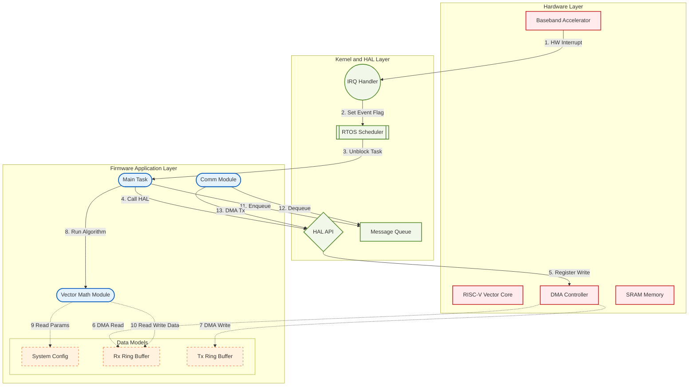
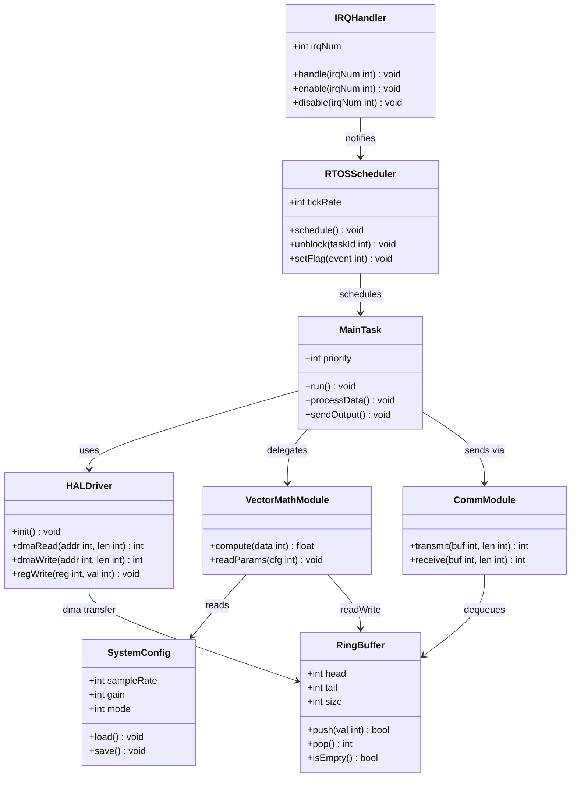
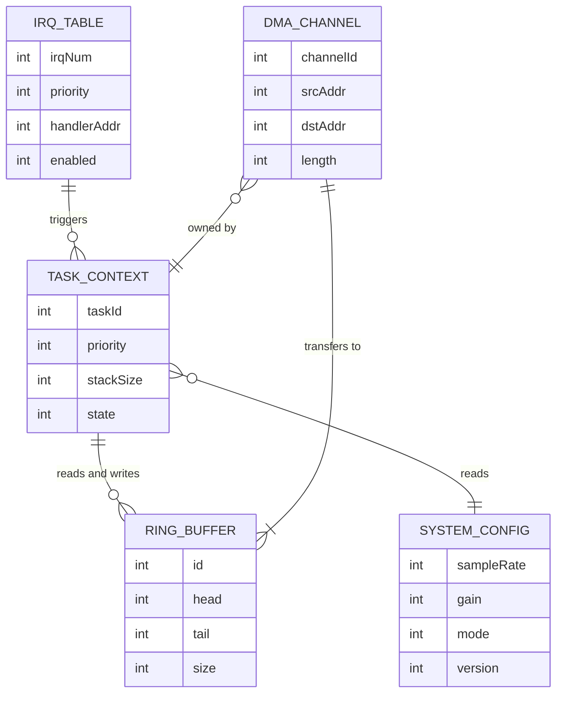

# Firmware Block Diagram

하드웨어, 커널, 펌웨어 계층을 Flowchart, Class Diagram, ER Diagram 세 가지 뷰로 설명합니다.

---

## 1. System Architecture — Flowchart

인터럽트 발생부터 펌웨어 처리까지의 전체 실행 흐름을 나타냅니다.

---

## 2. Software Class Structure — Class Diagram

펌웨어 소프트웨어의 주요 클래스와 의존 관계를 나타냅니다.

---

## 3. Data Model — ER Diagram

펌웨어가 관리하는 핵심 데이터 구조와 관계를 나타냅니다.

